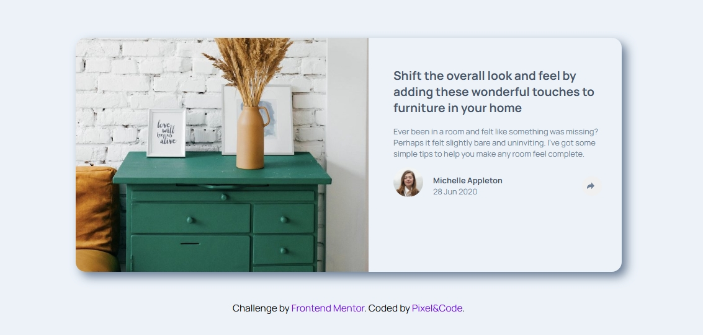

# Frontend Mentor - Article preview component solution

This is a solution to the [Article preview component challenge on Frontend Mentor](https://www.frontendmentor.io/challenges/article-preview-component-dYBN_pYFT). Frontend Mentor challenges help you improve your coding skills by building realistic projects. 

## Table of contents

- [Overview](#overview)
  - [The challenge](#the-challenge)
  - [Screenshot](#screenshot)
  - [Links](#links)
- [My process](#my-process)
  - [Built with](#built-with)
  - [What I learned](#what-i-learned)
  - [Continued development](#continued-development)
  - [Useful resources](#useful-resources)
- [Author](#author)
- [Acknowledgments](#acknowledgments)


## Overview
I built an interactive article preview card that displays article content with an author's avatar and a share button. When you click the share button, social media icons (Facebook, Pinterest, Twitter) appear in a nicely styled overlay. On smaller screens, the avatar section hides, and the entire bottom area becomes the share block.

### The challenge

Injected images via ```innerHTML``` were not loading correctly due to incorrect paths and syntax — needed to fix by providing valid paths and using correct HTML structure.

Keeping the share button fixed in place while toggling the social icons.

Handling different behavior on smaller screens (hiding the avatar and adjusting the background).

Making sure JavaScript doesn’t break when elements are missing or hidden.

### Screenshot




### Links

- Solution URL: [Add solution URL here](https://github.com/jeff20501/interactive-article-card)
- Live Site URL: [Add live site URL here](https://interactive-article-card.netlify.app/)

## My process

1️⃣ Planning and layout

Started by structuring the HTML, defining sections for the image, content, author info, and share button.

Focused on semantic structure for clarity.

2️⃣ Styling and responsiveness

Styled using CSS with flexbox for layout.

Implemented responsiveness for screens below 850px.

3️⃣ Adding interactivity

Used JavaScript to toggle the share icons on button click.

Handled dynamic updates (like showing/hiding avatars and changing background colors).

4️⃣ Debugging and refining

Solved issues where the share button’s position would shift when toggled.

Made sure that on mobile, only the share block shows, and the avatar hides.

### Built with

- HTML: for semantic structure.

- CSS: for styling, flexbox layouts, hover states, and responsive design.

- JavaScript: for interactivity (event listeners, DOM manipulation, toggling elements).

### What I learned

✅ How to dynamically inject HTML elements using innerHTML.
✅ How to toggle visibility using display: flex and display: none in JavaScript.
✅ How to keep an element fixed in place even when content changes.
✅ How to hide and show different blocks depending on the screen size and interaction state.
✅ How to improve responsive design by combining media queries and JavaScript logic.

To see how you can add code snippets, see below:

```html
<h1>Some HTML code I'm proud of</h1>
```
```css
.proud-of-this-css {
  color: papayawhip;
}
```
```js
const proudOfThisFunc = () => {
  console.log('🎉')
}
```


### Useful resources

- [Example resource 1](https://www.example.com) - This helped me for XYZ reason. I really liked this pattern and will use it going forward.


## Author

- Website - [Add your name here](https://www.your-site.com)
- Frontend Mentor - [@yourusername](https://www.frontendmentor.io/profile/yourusername)
- Twitter - [@yourusername](https://www.twitter.com/yourusername)

**Note: Delete this note and add/remove/edit lines above based on what links you'd like to share.**

## Acknowledgments

This is where you can give a hat tip to anyone who helped you out on this project. Perhaps you worked in a team or got some inspiration from someone else's solution. This is the perfect place to give them some credit.